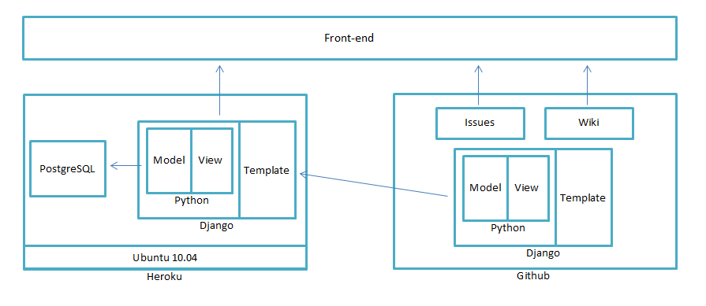

# Requirements
# Requirements

### Do you have written requirements?  Are they up to date?
We have written requirements at https://github.com/caylan/Bulletin/wiki/Requirements. They are up to date.

### What is the vision of your project?  What's the one sentence, 1 paragraph, and 1 page summary of what your project is?
One sentence: Bulletin is a collaboration tool for small, private groups

One paragraph: Bulletin is a collaboration tool for small, private groups. It enables any user to quickly set up a space for private status updates and comments, which only the group members have access to, allowing quick and easy communication. By providing live updating posts and comments, as well as an aggregate feed called Inbox, users can get work done quickly and easily.

[One page summary](https://github.com/caylan/Bulletin/wiki/Summary)

### What are the key metrics for success?  When will you plan to achieve various goals?  Are you achieving them?
Our key metrics for success are active users and feature releases. We decide on which goals we want to achieve on a per-cycle basis. We feel we are achieving what we’ve set out to do. As for active users, there wasn’t a goal set for this measure, but rather a comparison to previous cycles as to the growth and usage of the site.

### Do you have a requirements review process?  What is it?  Do you use it?
No. The closest to a requirements review process we have is through team meetings.

### Did you collect feedback?  What was it?  How did you use it?
We collected feedback from a UI/UX review team. They suggested several usability and visual design changes as well as the possibility of throwing out the Inbox altogether. We took many of their suggestions, but decided to continue with releasing the Inbox in the interest of this course, and because of the difficulty in changing the high-level design/re-integrating the features intended for Inbox in the middle of its scheduled release cycle.

### How close does your final deliverable match the original requirement/goals?  Were you successful at delivering the product?
We feel very close to our original requirements and goals. We hadn’t gotten to optimizing Bulletin for use with phones, but most everything else had been completed. We felt very successful with what we were able to deliver.

### What would your plans be for release 4, if there were to be one?
Hammering out the features that we’ve introduced this release, including Inbox showing group invites and aggregates of comments. Removing users from a group but leaving their posts intact. Create a more informative registration process, including a better info page and possibly a tutorial.

### What is the longer term (1 year) for your project?
During the next year, we'd like Bulletin to take on more of a project management focus and have tools available that users could take advantage of in the groups, such as assignable tasks, project agendas and video chat. We'd also like to provide a plugin system so that users can make their own tools. Also, allowing users to have multiple emails linked to the same account seems like a small issue but has proven difficult for even companies as large as Google. Tackling this early on would be smart.

# Design

### Do you have written design specifications?  Are they up to date?
We do have written design specifications at https://github.com/caylan/Bulletin/wiki/Architecture. They are up to date.

### Do you have a design review process?  What is it?  Do you use it?
We do not have a formal design review process. Design was iterative and decisions were made as necessary, which may have been less than ideal, but has worked out so far.

### Is your software modular?  Do you have clean interfaces -- interfaces that are "cleanly" separated from implementation?
It’s not as modular as we'd prefer, there are several dependence between the different subsystems that a major refactor could focus on.

### Is your software loosely coupled?  Your organization?  Has it aided in the success of your project?
The software is not loosely coupled, but our organization is. The looseness of the team means that we are able to focus on tasks without the worry of coordinating with the team. A drawback is that the meetings are used to bring members of the team up to spec on what has been completed, and to re-synch the team.

# Architecture

### What is your architecture? Is there an up to date document to reflect this?
The document for architecture can be accessed at https://github.com/caylan/Bulletin/wiki/Architecture.

### What is your run time platform?  How did you choose it?
Our run time platform is the web browser. It’s something that is used across different operating systems. It provides flexibility and accessibility.

### Do you have an architecture review process? What is it? Do you use it?
We do not have a formal architecture review process. The architecture we set in place has worked out well so far. A review process would probably be a good thing as the project moves beyond it's beginnings.

### What is your design center for scale?  Any idea how you will grow beyond that?
We haven’t yet designed our app for scaling. We had discussed using vertical scaling, as the focus wouldn’t be on sharing data with a large amount of users, but rather to small, specific groups.

# Implementation

### Do you have coding standards?  What is it? Do you use it?
Our coding standards were very simple. We tried to follow the HTML 5 standards set by the w3c, and the general python coding standards.

### Do you successfully use a source code/version control system?
We successfully used Git and GitHub as our code/version control system.

### What is your version management strategy?  Branch a lot?  Branch as little as possible?  What is your team's philosophy on branching?
Version management strategy was simple. We branched on major features that would take more than a day to implement. No branching on UI code or smaller fixes. Our philosophy was to do things right and in small increments that wouldn't ruin the master branch.

# Testing

### What is your test strategy?  Do you have a regression test suite?
Our testing strategy has been to use multiple test levels - unit, integration, and system testing - in a regression test suite to both protect key portions of the code work and to prevent old bugs from reoccurring. We also wanted to ensure that our environmental requirements were met - meaning our site worked on Firefox, Chrome, IE, and Opera. We used both manual and automated testing to check for errors. Testing kind of took a backseat to development at times, as the architecture did change at points of the project, breaking certain tests. Our regression test suite can be run at any time using nose and selenium in a virtual environment. The results are reported based upon the web driver specified (browser).

### Do you have a bug database? Do you use it?  How do you use it? (What's the process for filing, triaging, fixing bugs, and deploying fixes? How many bugs have been filed?
We have a bug database on GitHub that is incorporated into the issue tracker. We have been using it for features and bugs, anything that’s been identified as a task that can be assigned. We use it pretty regularly, whenever there is an issue that we identify or is brought to our attention  we post it to the tracker if it’s not a quick fix. The process for such issues  is generally something like, identify an issue, post it, decide the best course of action, assign it and deploy it.  Currently we’ve had twelve bugs filed, along with forty three other issues.

### Do you have a code review process?  What is it? Do you use it?
Yes. We use pair programming as our code reviewing process. Pair programming is an agile software development technique in which two programmers work together at one workstation. We didn’t use it as much as we’d have preferred.

### Do you have a test server?  Where is it deployed?  How close does it look like the live site?
We do not have a dedicated test server. Testing is done on the staging server or on local machines.

# Deployment

### Where do you deploy your live site?  Why did you choose this? What are the physical and logical topologies?
Bulletin is deployed on http://www.bulletinapp.net which is hosted by Heroku. We chose Heroku because of its magnificently easy deployment set up with Django. Heroku's physical topology can be found [here](http://www.heroku.com/how). As for our logical topology:

### Do you have a build process?  Is it nightly?
We push changes to the staging site after major changes. It is not nightly.

### What is your deployment process?  How many steps?  Is it documented?
Our deployment process is to clone the heroku repo, then add a remote repo to our master branch on GitHub, use ‘git fetch’ to grab the latest version, and then run ‘git merge’ to merge the master branch into the heroku branch without affecting the main development branch.  Afterward, the code is pushed to the heroku deployment server. It’s a total of four steps, and it isn’t currently documented.

### Do you have a staging server?  Where is it deployed?  How close does it look like to the live site?
We have a staging server. It is deployed at bulletin-staging.herokuapp.com. It looks nearly identical to the live site.

### Do you back up your software?  Your data?  Can you recover?  Under what conditions?
We back up our software through version control. Our data is currently not backed up, but we were discussing methods to make sure it was, such as south. We can recover our software via version control. We have to have a connection to the internet, and GitHub must be up.

### Do you have monitoring software in place?  What is it? How do you use it?
We use Google Analytics to gather information on site access. However, we have nothing to monitor site crashes and problems.

# Process

### What is the process for delivering software?  How did you come to this decision?
The process for delivering software was evolutionary delivery, as it provided us with the ability to experiment with different features before finalization.

### What was your team organization structure like? Who does what? How did this work out? In retrospect, would you have organized your team differently?
We decided to separate the managerial roles into 2 parts, project lead and project manager. The project lead had the vision for the project, while the project manager served more of a secretarial role. The remaining members were split into 2 main groups, frontend and backend. However these assignments weren’t intended to be constraints, but rather a general area in which they would focus on. We felt that it could have been organized more clearly. Some members wish that their assigned tasks were more explicit, and assigned at a punctual time.

### What are the communication mechanisms your team uses?  Discuss all the methods/processes in addition to your wiki
Our team used GitHub’s resources, as well as facebook groups, google docs, and email. We also met twice a week in order to coordinate many of the issues to be addressed.

### Did your team use weekly status reports to communicate?  An alternative mechanism?
Our team used status reports, but our primary tool for communication was through physical meetings and facebook groups.

### Do you have an up to date schedule?
Yes, for the last three releases. We do not have a schedule set for any releases beyond this course.

### If a new developer comes on board, how do they bring up a development environment?  Is it documented?
We do have some documentation about the development environment in our readme, although it is not up to date. Andrew acted as everyone else's tech support for setting up the dev environment.

### Have you released your project onto GitHub for public consumption?
Bulletin is on GitHub for public consumption.

### Do individuals have GitHub projects where they show case your project?  Why or why not?
We're not sure what this question is asking. The main project is hosted on Caylan's GitHub and the other group members are contributors to it.

### Where do you use divide and conquer in your project?
We use divide and conquer in assigning individual features. We tried using divide and conquer in our presentation, but it didn’t yield the desired result. There was a lot of partitioning between frontend and backend. The UI/UX team didn’t need to know too much about the backend development in order to carry it out, and the backend had only to explain parts of their development to implement features. Django’s model-template-view style helped in partitioning tasks.

# Miscellaneous

### What decisions did your team make that turned out to be mistakes?  How did you correct for them?
We didn’t have a testing environment early on. That resulted in some issues for our second release and a one hour delay. We corrected that by first deploying to a staging server to check that everything was functioning properly for future releases.

### What three big lessons did you learn from working on this project?
1. Start early.
2. People are difficult to manage.
3. Conduct more research/experiment with the technology before deciding on which tools/technologies to use.